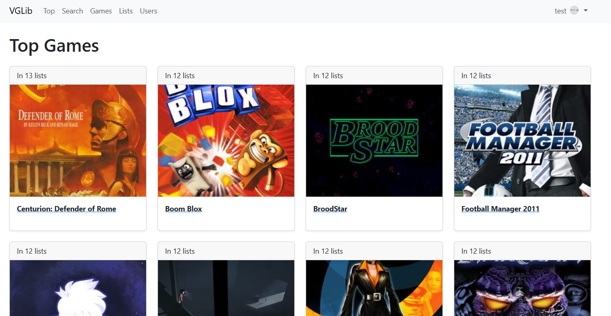

# VG Lib

VGLib is a web platform that provides a comprehensive catalogue of videogames across multiple platforms such as the PlayStation Store, Steam, Epic Games, Nintendo eShop, Xbox, and other physical editions. Users can browse through data on games and create personalized collections for their own purposes, such as owned games, wishlists, and games they enjoy watching streamed.

## Project Objective

Create a new project using the same technologies for creating the backend, but using React with hooks for the front end. This will be a client side rendered application that will use AJAX to access data from the backend and render it using React.

## Authors

Yash Mahesh Burshe and Ben Piperno as part of [NEU CS5610: Web Development Spring 2026](https://johnguerra.co/classes/webDevelopment_online_spring_2026/ "Class Link")

## Screenshot

## Usage

1. Navigate to the deployed website.
2. Login with test credentials: username: `test` password `test`
3. Explore games in the library, add them to your custom lists, and view other users and find which games are trending

## Instructions to Build

- Option 1: Visit the deployed version at:
- Option 2: Follow the steps below:
  1. Clone this repo
  2. Create a mongoDB deployment (either locally or via cloud). Use the example data provided in `./backend/dataexamples` for the games, users, and lists collections. Ensure the collection names match those set in `./backend/db/mongodb.js`
  3. Create a file named `.env` and place it in the root of the project. in it add the MongoDB connection string using the key "MONGODB_URI".
  4. Generate a JWT secret key and place it in the .env file using the key "JWT_SECRET"
  5. Install all required libraries by calling `npm install` inside both the `frontend` and `backend` folders.
  6. Build a local version of the front end using the following command while in the `frontend` folder: `npm run build`.
  7. Finally, run the backend server with the command `npm start` from the `backend` folder.

## Class Links:

- [Deployment URL](https://vglib.onrender.com "View the website as an end user")
- [Design Documents](/designdoc/README.md "View planning materials")
- [Presentation Slides](https://docs.google.com/presentation/d/1D69h_bxtXzOx8lmD1nvb9B6FIwDBmkb7k5RjO4Jvrok/edit?usp=sharing "View slides on this website's design and implmentation")
- [Video Demonstration](https://www.markdownguide.org "Watch us present on this website")

## Attribution:

Spell Icon credited to Delapouite per [games-icon.net](https://game-icons.net/1x1/delapouite/spell-book.html "CC")
